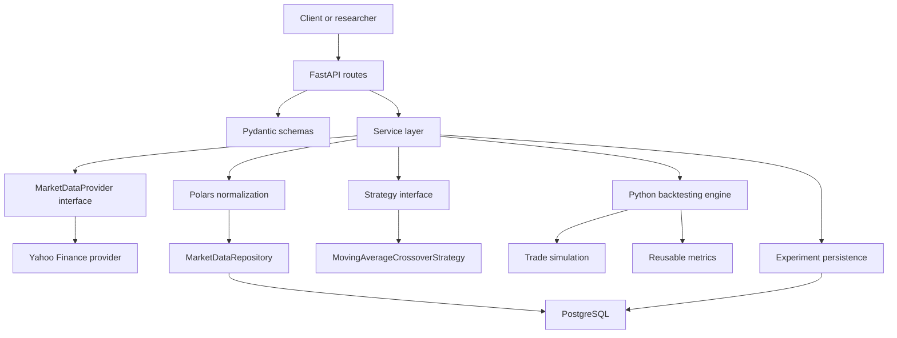

# Mercury

Mercury is a self-improving autonomous quant research platform. Phase 2 builds the
market-data and backtesting engine that future autonomous agents will use as a
deterministic research tool.

Phase 2 deliberately excludes agentic strategy generation, memory, RAG, and
self-improvement loops. The priority is a reproducible experiment path: ingest data,
run a strategy, simulate trades, calculate metrics, persist results, and expose the
workflow through the API.

## What Phase 2 Supports

- Fetch historical OHLCV bars through a provider interface.
- Normalize, validate, store, and query market data.
- Run a moving-average crossover strategy.
- Simulate long-only trades with cash, shares, fees, and slippage.
- Calculate total return, annualized return, Sharpe, Sortino, volatility, max
  drawdown, win rate, turnover, costs, and ending portfolio value.
- Persist experiment metadata, metrics, observability metadata, and trade records.
- Expose market-data and backtest workflows through typed FastAPI endpoints.
- Run deterministic unit and integration tests without live market-data calls.
- Keep Docker and GitHub Actions ready for CI.

## Architecture

Mercury remains a modular monolith: one deployable application with separated
HTTP, service, strategy, backtesting, metrics, and persistence boundaries.



## Backtest Flow

```text
fetch data
  -> normalize and store OHLCV bars
  -> load bars for symbol and date range
  -> generate moving-average signals
  -> shift signals by one bar to avoid look-ahead bias
  -> execute simulated buy/sell trades at the next bar open
  -> apply transaction fees and slippage
  -> mark portfolio value at each close
  -> calculate metrics
  -> store experiment result and trades
  -> return a typed API response
```

The strategy decides desired exposure. The engine decides execution, portfolio
accounting, costs, equity, metrics, and persistence. That split is important
because future agents should be able to swap strategies without changing the
backtester.

## Technology Choices

- FastAPI provides REST endpoints and OpenAPI documentation.
- Pydantic defines request and response contracts.
- SQLAlchemy maps Python models to PostgreSQL tables.
- Alembic versions schema changes.
- PostgreSQL stores market bars, experiments, metrics, metadata, and trades.
- yfinance is the first development market-data provider.
- Polars handles tabular market-data transformations and signal generation.
- NumPy supports reusable performance metric calculations.
- pytest validates deterministic behavior.
- Ruff and mypy keep formatting, linting, and types checked in CI.

## Local Setup

```bash
python -m venv .venv
.venv\Scripts\activate
pip install -e ".[dev]"
copy .env.example .env
```

For Docker:

```bash
docker compose up --build
```

The API will be available at `http://localhost:8000`.

## Developer Commands

```bash
ruff check .
ruff format .
ruff format --check .
mypy app
pytest
python scripts/benchmark_backtest.py --rows 10000
alembic upgrade head
uvicorn app.main:app --reload
docker compose up --build
docker build .
```

## API Examples

Health:

```bash
curl http://localhost:8000/health
```

Ingest market data:

```bash
curl -X POST http://localhost:8000/market-data/fetch \
  -H "Content-Type: application/json" \
  -d '{"symbol":"MSFT","start":"2024-01-01","end":"2024-06-01","interval":"1d"}'
```

List stored bars:

```bash
curl "http://localhost:8000/market-data/MSFT?start=2024-01-01&end=2024-06-01&interval=1d"
```

Run a backtest:

```bash
curl -X POST http://localhost:8000/backtests \
  -H "Content-Type: application/json" \
  -d '{"symbol":"MSFT","start":"2024-01-01","end":"2024-06-01","interval":"1d","short_window":20,"long_window":50,"initial_capital":10000,"transaction_cost_bps":1,"slippage_bps":2}'
```

Read a backtest:

```bash
curl http://localhost:8000/backtests/{id}
curl http://localhost:8000/backtests/{id}/trades
```

## Backtesting Notes

The baseline strategy is moving-average crossover:

- Calculate fast and slow moving averages from close prices.
- Target long exposure when the fast average is above the slow average.
- Target flat exposure when the fast average is below the slow average.
- Shift the signal by one bar before execution.

The signal shift is Mercury's first look-ahead prevention rule. A signal computed
from one bar's close is not allowed to earn that same bar's return. The engine
executes position changes at the following bar open and marks equity at the close.

Transaction costs are charged as basis points of executed notional. Slippage moves
the execution price against Mercury: buys pay above the open, sells receive below
the open. Portfolio value is cash plus shares marked to the current close.

## Metrics

- Total return: ending portfolio value divided by starting capital, minus one.
- Annualized return: total return scaled to 252 trading days.
- Sharpe ratio: average strategy return per unit of volatility, annualized.
- Sortino ratio: average strategy return per unit of downside volatility.
- Maximum drawdown: largest peak-to-trough equity decline.
- Volatility: annualized standard deviation of strategy returns.
- Win rate: percentage of closed trades with positive realized PnL.
- Turnover: executed notional divided by average equity.
- Transaction costs and slippage costs: total simulated friction paid.

## Testing And CI

Tests use deterministic fixtures and a stubbed market-data provider so CI does not
depend on Yahoo Finance availability.

GitHub Actions runs on pushes to `main` and pull requests targeting `main`:

1. Install dependencies.
2. Run Alembic migrations against PostgreSQL.
3. Run Ruff lint.
4. Run Ruff format check.
5. Run mypy.
6. Run pytest, including integration tests.
7. Build the Docker image.

## C++ Optimization Candidates

Keep the engine Python-first until profiling proves a real bottleneck. Future C++
components should be exposed back to Python with pybind11 so Mercury keeps a
simple API while moving hot loops to native code.

Realistic future candidates:

- Event-driven backtest loop for very large datasets.
- Portfolio accounting and order execution when position logic becomes complex.
- Large-scale indicator calculation across many symbols.
- Order-book or high-frequency simulation.
- Market-data processing where Python dataframe overhead dominates runtime.

## Reading Guide

### Must Read

- `app/main.py`: creates the FastAPI application and includes route modules.
- `app/backtesting/engine.py`: simulates trades, costs, equity, metrics, and
  observability metadata.
- `app/backtesting/strategy.py`: defines the strategy boundary and moving-average
  crossover signal generation.
- `app/backtesting/metrics.py`: reusable objective/evaluation metrics.
- `app/experiments/service.py`: connects stored data, strategy execution, and
  experiment persistence.

### Read Next

- `app/models/market_data.py`: OHLCV table shape and uniqueness rules.
- `app/models/experiment.py`: experiment and trade persistence models.
- `app/market_data/service.py`: ingestion orchestration.
- `app/market_data/repository.py`: market-bar upsert and query behavior.
- `app/market_data/normalization.py`: provider data validation and normalization.
- `app/market_data/provider.py`: provider interface.
- `app/market_data/yahoo.py`: yfinance provider implementation.
- `app/api/routes/market_data.py`: market-data HTTP workflow.
- `app/api/routes/backtests.py`: backtest HTTP workflow.
- `app/schemas/experiment.py`: typed backtest request, result, and trade contracts.
- `tests/unit/test_backtesting.py`: deterministic strategy, execution, cost, and
  metric checks.
- `tests/integration/test_api.py`: end-to-end API workflow test.

### Can Skim

- `app/core/config.py`: environment-driven app settings.
- `app/db/session.py`: SQLAlchemy engine and session setup.
- `alembic/versions/*.py`: database migration history.
- `.github/workflows/ci.yml`: CI pipeline.
- `Dockerfile` and `docker-compose.yml`: containerized runtime.
- `Makefile`: local command shortcuts.
- `scripts/benchmark_backtest.py`: synthetic Python backtester benchmark.

The five most important files after Phase 2 are `app/backtesting/engine.py`,
`app/backtesting/strategy.py`, `app/backtesting/metrics.py`,
`app/experiments/service.py`, and `app/models/experiment.py`.

Mental model: the strategy turns bars into desired positions, the engine turns
positions into trades and equity, metrics score the equity/trades, the experiment
service persists the run, and the experiment models define exactly what survives
in PostgreSQL for future agents to inspect.
